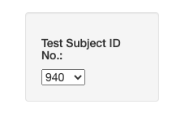
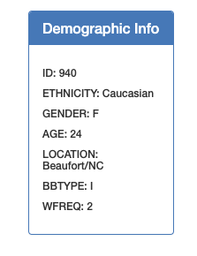
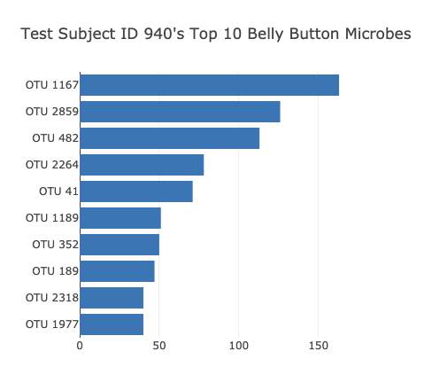
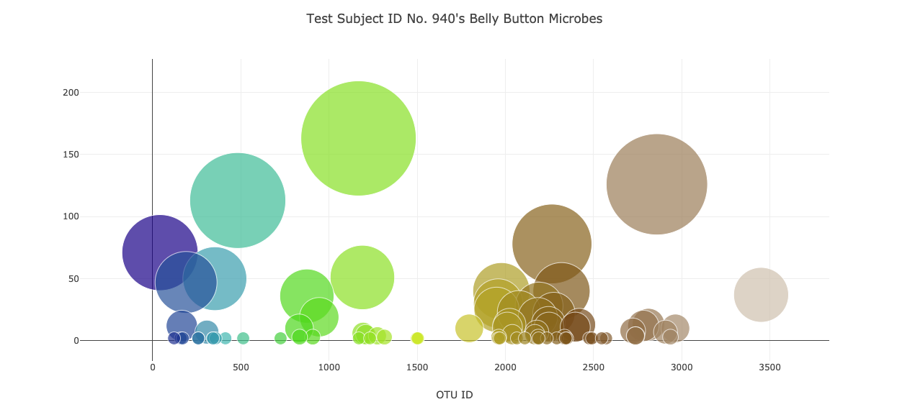
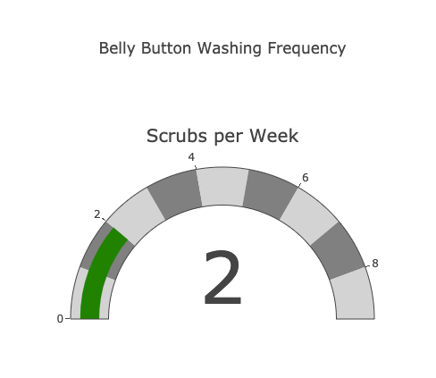
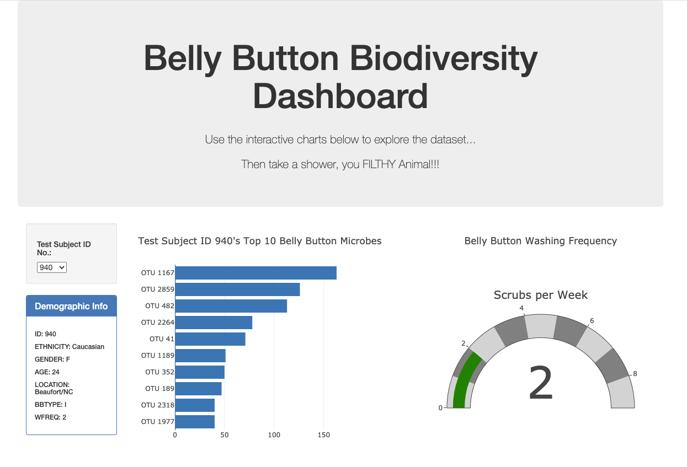
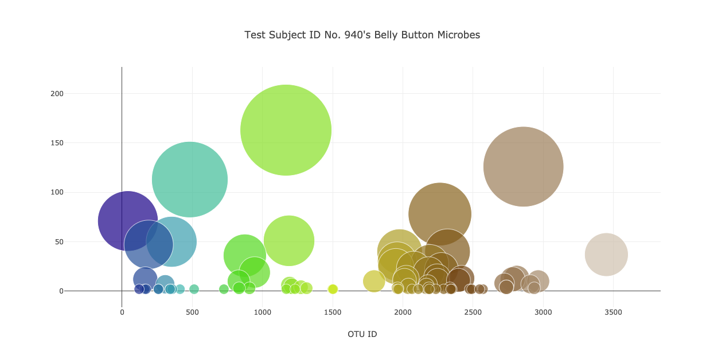

# Belly Button BioDiversity: Plotly-Challenge
HW 12 in UCF Data Analytics &amp; Visualizations Bootcamp

For website, [click here!](https://sofiaas1.github.io/Plotly-Challenge/)

In this assignment, we built an interactive dashboard to explore the [Belly Button Biodiversity dataset](http://robdunnlab.com/projects/belly-button-biodiversity/), which catalogs the microbes that colonize human navels.

The dataset reveals that a small handful of microbial species (also called operational taxonomic units, or OTUs, in the study) were present in more than 70% of people, while the rest were relatively rare.

Dashboard came together in a series of steps, starting with...

1. Used the D3 library to read in samples.json.

2. Displayed each key-value pair from the metadata JSON object somewhere on the page.

3. Displayed the sample metadata, i.e., an individual's demographic information.

4. Created a horizontal bar chart with a dropdown menu to display the top 10 OTUs found in that individual.

* Used sample_values as the values for the bar chart.

* Used otu_ids as the labels for the bar chart.

* Used otu_labels as the hovertext for the chart.

5. Created a bubble chart that displays each sample.
* Used otu_ids for the x values.

* Used sample_values for the y values.

* Used sample_values for the marker size.

* Used otu_ids for the marker colors.

* Used otu_labels for the text values.

6. Adapted the Gauge Chart from https://plot.ly/javascript/gauge-charts/ to plot the weekly washing frequency of the individual.
* Modified the gauge code for values ranging from 0 through 9.

7. Set up all of the plots to update any time that a new sample is selected.

8. Updated the provided layout beyond the basic template provided to keep my dashboard original.

9. Deployed the dashboard to GitHub Pages (see link at top).
